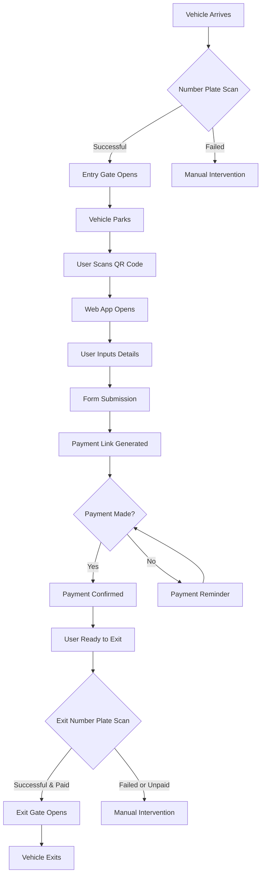

Here's a detailed flowchart and system design for your Smart Parking Management System:

Detailed System Design:

1. Hardware Components:
   - Entry/Exit Gates with barrier arms
   - ANPR Cameras at entry and exit points
   - QR Code displays throughout the parking area
   - Server infrastructure to host the system

2. Software Components:
   a. ANPR System:
      - Image capture module
      - Plate recognition algorithm
      - Database integration for vehicle tracking

   b. Web Application:
      - User interface for data input
      - QR code scanner integration
      - Payment gateway integration
      - Backend API for data processing and storage

   c. Database Management System:
      - Store vehicle information
      - Track parking durations
      - Manage user accounts and payments

   d. Payment System:
      - Integration with popular payment gateways
      - Secure transaction processing
      - Receipt generation and storage

   e. Gate Control System:
      - Interface with ANPR system
      - Automated open/close mechanisms
      - Manual override capabilities

3. System Integration:
   - API layer for communication between components
   - Real-time data synchronization
   - Secure protocols for data transmission

4. User Interface:
   - Mobile-responsive web application
   - Intuitive form for vehicle and user details
   - Clear payment interface
   - Parking duration and cost display

5. Security Measures:
   - Encrypted data transmission
   - Secure user authentication
   - Regular security audits and updates

6. Scalability Considerations:
   - Cloud-based infrastructure for easy scaling
   - Load balancing for high-traffic periods
   - Modular design for adding new features

7. Monitoring and Maintenance:
   - Real-time system health monitoring
   - Automated alerts for system issues
   - Regular backups and disaster recovery plans

8. Reporting and Analytics:
   - Dashboard for parking usage statistics
   - Revenue reports
   - Occupancy trends and peak hour analysis

This system design provides a comprehensive overview of the components and their interactions in your Smart Parking Management System. You can further detail each component based on the specific technologies and frameworks you choose to implement.